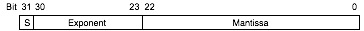
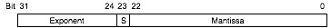

#### Frequently Asked Questions

* * *

<dt id="faq1">**What is a Floating Point Coprocessor?**</dt>

<dd>A floating point coprocessor is a separate processor, with its own instruction set and data storage. It performs floating point calculations on behalf of the main microcontroller. The microcontroller sends instructions and data to the coprocessor, the coprocessor performs the calculations, and the results are returned to the microcontroller.</dd>

<dt id="faq2a">**What is a uM-FPU64 Floating Point Coprocessor?**</dt>

<dd>The uM-FPU64 Floating Point Coprocessor is designed to provide microcontrollers with 64-bit and 32-bit floating point and integer capabilities. It can be used by virtually any microcontroller using a SPI or I2C interface. The uM-FPU64 chip has an extensive set of instructions for performing both 64-bit and 32-bit floating point and integer calculations. It contains 128 64-bit registers, 128 32-bit registers, 4096 bytes of Flash memory and 2304 bytes of RAM. User-defined functions can be stored in Flash memory, to provide faster execution times and reduce data transfer overheads. Additional features provided by the uM-FPU64 chips include: up to nine 12-bit analog inputs, up to 23 digital inputs, local device support including RAM, 1-Wire, I2C, SPI, UART, counter, servo controller, LCD, and VDrive2 devices, matrix operations, string handling capabilities, and serial I/O with support for parsing NMEA sentences. See the product pages for more detail.</dd>

<dt id="faq2b">**What is a uM-FPU V3.1 Floating Point Coprocessor?**</dt>

<dd>The uM-FPU V3.1 Floating Point Coprocessor is designed to provide microcontrollers with 32-bit floating point capabilities. It can be used by virtually any microcontroller using a SPI or I2C interface. The uM-FPU V3.1 chip has an extensive set of instructions for performing both 32-bit floating point and 32-bit integer calculations. It contains 128 32-bit registers, 1024 bytes of EEPROM, and 2304 bytes of Flash memory. User-defined functions can be stored in Flash memory or EEPROM, to provide faster execution times and reduce data transfer overheads. Additional features provided by the uM-FPU V3 chips include: two 12-bit analog to digital converters, a 32-bit event counter, a 32-bit timer, matrix operations, string handling capabilities, and serial I/O with support for parsing NMEA sentences. See the product pages for more detail.</dd>

<dt id="faq3">**What kind of devices require floating point?**</dt>

<dd>Much of the data from the sophisticated sensors available for embedded control applications can benefit from floating point calculations to compensate and convert the data output. The uM-FPU V3 chip makes it easy to perform complex calculations and implement the formulas described in datasheets and application notes. For example, the Sensirion SHTxx humidity and temperature sensors are single chip modules that provide calibrated digital output over a 2-wire serial interface. These modules are easily connected to a microcontroller, but to achieve full accuracy, floating calculations must be performed. These calculations compensate for the non-linearity of the humidity sensor, convert the data to standard units of temperature and relative humidity, and determine the dewpoint using a logarithmic equation.
The Sensirion datasheet and application notes define the following formulas:
(for VDD = 5V)

> TemperatureC = -40.0 + 0.01 * SOT
> 
> RHlinear = -4.0 + 0.0405 * SORH + (-2.8 * 10-6 * SORH2)
> 
> RHtrue = (TemperatureC - 25.0) * (0.01 + 0.0008 * SORH) + RHlinear
> 
> H = (log10(RHtrue) - 2.0) / 0.4343 + (17.62 * TemperatureC) / (243.12 + TemperatureC)
> 
> DewPoint = 243.12 * H / (17.62 - H)

These formulas are easily implemented using the uM-FPU V3 chip with very little overhead on the microcontroller. See [Application Note 33 - Sensirion SHTxx Temperature and Humidity Sensor](appnotes.html). Examples of other sensors that provide data output that can be further enhanced with floating point calculations include: position sensors, thermocouples, accelerometers, gyroscopes, pressure sensors and many others.</dd>

<dt id="faq4">**What overhead is associated with the uM-FPU coprocessors?**</dt>

<dd>The microcontroller needs to send instructions and data to the coprocessor and read the results after calculations are complete. The main overhead is the time required to transfer information between the microcontroller and uM-FPU. The uM-FPU chip has a 256 byte instruction buffer which allows calculations to be done while data is being transferred. The microcontroller is free to perform other tasks while the uM-FPU performs floating point calculations. The uM-FPU V3.1 has 128 32-bit registers and 2304 bytes of EEPROM, for storing floating point values on the uM-FPU rather than consuming code and data space on the microcontroller. User-defined functions can also be used to improve execution speed and reduce code space. With user-defined functions, only input data and results need to be transmitted.</dd>

<dt id="faq5">**What development support is available for the uM-FPU coprocessors?**</dt>

<dd>The uM-FPU V3 IDE (Integrated Development Environment) provides support for creating uM-FPU code targeted to a variety of microcontrollers and compilers. It also contains a run-time debugger, and user-defined function programmer using the built-in serial connection on the uM-FPU V3 chip. The uM-FPU IDE provides a convenient way to develop and test uM-FPU V3 code. Documentation is available on the Micromega website including many examples and application notes.</dd>

<dt id="faq6">**Do I have to learn a new instruction set in order to use the uM-FPU V3 chip?**</dt>

<dd>The uM-FPU IDE has a code generator that takes standard mathematical expressions and converts them to uM-FPU code. The code can be targeted to one of the many microcontrollers and compilers supported, or output as uM-FPU instructions that can be copied to another application. By using the uM-FPU IDE, it's possible to develop code without knowing all of the details of the uM-FPU instruction set, but an understanding of the basics is certainly beneficial. The code generator in the uM-FPU V3 IDE is essentially a compiler that produces uM-FPU assembler code. As with other code development, working directly with the uM-FPU assembly code can allow the development of more concise and efficient code.</dd>

<dt id="faq7">**Why do some designers avoid floating point?**</dt>

<dd>Many designers of embedded systems assume that microcontrollers and floating point math don't work well together. There's been good reason for this in the past since most microcontrollers don't provide hardware support for floating point so these calculations must be performed in software. This results in slower execution time for floating point versus integer calculations, and large code space requirements for floating point software libraries. Data space is also affected since 32-bit floating point variables require four bytes of data storage. The uM-FPU V3 Floating Point Coprocessor provides a solution to these problems by providing extensive floating point capabilities while eliminating most of the memory and execution speed overhead on the microcontroller. This makes it possible to use floating point even on microcontrollers with very limited resources.</dd>

<dt id="faq8">**Don't most devices have integer output data?**</dt>

<dd>Yes, integer data is the most common form of output from sensors and other digital devices, but to use this data it's often necessary to compensate for non-linearities, convert to different units, or otherwise transform the data. Floating point makes these calculations very easy to implement. Once the input data is transformed, the application itself may require floating point calculations (e.g. trigonometric calculations for positioning and navigation). The uM-FPU V3 chip has a number of instructions designed to make it easy to convert integer input values and strings to floating point values. It also has support for converting floating point results to integers and to formatted strings. The string formatting capabilities make it easy to create the text needed for output displays.</dd>

<dt id="faq9">**Can't most calculations be done with integers?**</dt>

<dd>That depends on the type of calculations you plan to do. If it's just a matter of dealing with a few fractional values, you can scale integer values and store them as fixed-point numbers. As calculations become more complex, or the fractional values are not easily represented by scaled integers (e.g. 1/3), techniques to avoid the use of floating point numbers often become quite elaborate. This can add a layer of complexity on top of the original equations being calculated. Many integer techniques introduce approximation errors resulting in less accurate results. Although some more advanced calculations such as logarithmic and trigonometric calculations can be done with integers using table lookups, the resolution of these calculations is limited by table size. Floating point calculations support a much larger range of numbers and a more complete range of calculations.</dd>

<dt id="faq10">**What is a floating point number?**</dt>

<dd>A floating point number is the representation of a real number that consists of three parts:

* a significand, or mantissa, that defines the magnitude of a number
* an exponent, that scales a number
* a sign, that indicates if a number is positive or negative

Microcontrollers most commonly use floating point numbers stored as 32-bit values. The uM-FPU V3 chip conforms to the standard for 32-bit IEEE 754 floating point numbers, but it can also read and write an alternate 32-bit format used by some Microchip PIC assemblers and compilers.</dd>

<dt id="faq11">**What is the IEEE 754 standard?**</dt>

<dd>The IEEE 754 standard was created to standardize the representation and manipulation of floating point numbers by computers. It defines a standard for 32-bit and 64-bit floating point numbers and is the standard used by most desktop computers and compilers. Microcontroller applications typically use 32-bit floating point numbers. The 32-bit IEEE 754 representation is as follows:

**Sign Bit (bit 31)**
The sign bit is 0 for a positive number and 1 for a negative number.

**Exponent (bits 30-23)**
The exponent field is an 8-bit field that stores the value of the exponent with a bias of 127 that allows it to represent both positive and negative exponents. For example, if the exponent field is 128, it represents an exponent of one (128 ­ 127 = 1). An exponent field of all zeroes is used for denormalized numbers and an exponent field of all ones is used for the special numbers +infinity, -infinity and Not-a-Number (described below).

**Mantissa (bits 22-0)**
The mantissa is a 23-bit field that stores the precision bits of the number. For normalized numbers there is an implied leading bit equal to one.

Some examples of IEEE-754 32-bit floating point values are as follows:

| Real number | IEEE 754 representation |
|-------------|-------------------------|
| 1.0         | 3F800000                |
| 2.0         | 40000000                |
| 3.1415927   | 40490FDB                |
| -1.0        | BF800000                |
| -100.0      | C2C80000                |

</dd>

<dt id="faq12">**Why are floating point numbers often represented as hexadecimal numbers?**</dt>

<dd>It's just a convenient and concise way to specify a 32-bit value. For someone familiar with the format it's also easier to identify the three separate parts of the floating point number.</dd>

<dt id="faq13">**What is the alternate PIC format?**</dt>

<dd>Some Microchip PIC assemblers and compilers use an alternate 32-bit format for storing floating point numbers. PIC. The mantissa, exponent, and sign are stored as follows:

The uM-FPU can be set to always read and write PIC format numbers by setting a bit in the mode byte, or the PICMODE and IEEEMODE instructions can be used to switch modes as required.</dd>
